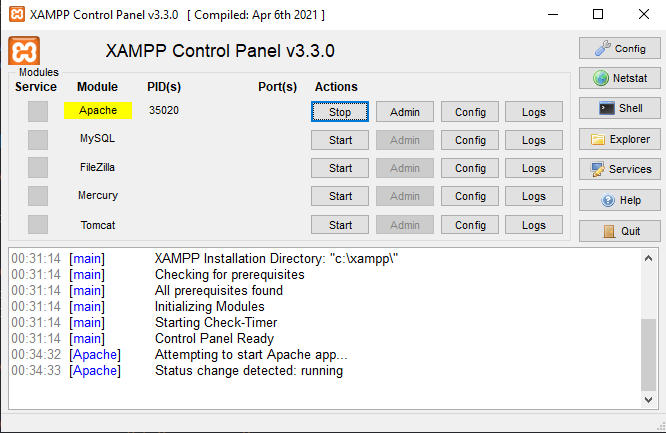

# 🛍️ GeekStore

Projeto de uma landing page de loja virtual de produtos geek desenvolvido para fins educacionais, utilizando as principais tecnologias para desenvolvimento WEB.

## 📋 Sumário

- [Sobre o Projeto](#sobre-o-projeto)
- [Funcionalidades](#funcionalidades)
- [Tecnologias Utilizadas](#tecnologias-utilizadas)
- [Pré-requisitos](#pré-requisitos)
- [Como Executar o Projeto](#como-executar-o-projeto)
- [Licença](#licença)

---

## 📌 Sobre o Projeto

O **GeekStore** é uma loja virtual fictícia com o objetivo de simular a venda de produtos geeks. O foco do projeto está em praticar conceitos de front-end, incluindo:

- HTML
- CSS
- JS
- PHP

---

## ✨ Funcionalidades

- 🤖 Responsividade

---

## 🧰 Tecnologias Utilizadas

- HTML5
- CSS3
- JavaScript ES6+
- PHP
- XAMPP

---

## ⚙️ Pré-requisitos

Certifique-se de ter instalado:

- [VSCode](https://code.visualstudio.com/)
- [XAMPP](https://www.apachefriends.org/pt_br/index.html)

---

## ▶️ Como Executar o Projeto

1. **Clone o repositório**

```bash
git clone https://github.com/maugois/GeekStore.git
```
2. **Acesse a pasta do projeto**

```bash
cd C://xamp/htdocs/GeekStore
```

3. **Ligue o servidor WEB do XAMPP**



4. **Acesse a landing page via navegador**

http://localhost/GeekStore/index.php

---

## 📕 Licença

Este projeto está licenciado sob a Licença MIT.  
Você pode usá-lo livremente para fins educacionais e pessoais.

Veja o arquivo [LICENSE](LICENSE) para mais detalhes.   
